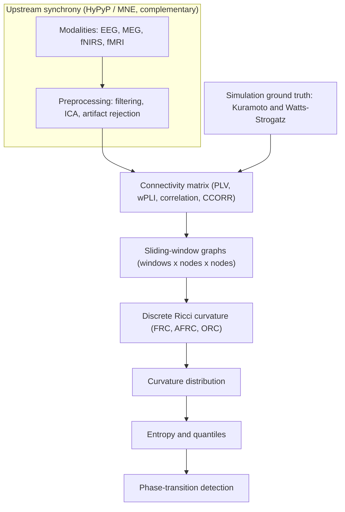

# HyPhi(Φ)


[](https://doi.org/10.5281/zenodo.18415664)

[](https://shescher.github.io/scilaunch/)

***
A Python package for hyperscanning data analysis by tracking inter-brain network curvature and its entropy distribution.

## Overview

`HyPhi` implements a geometry-driven alternative to traditional synchrony-based hyperscanning analysis.

The pipeline includes:

- A ground-truth simulation framework based on coupled Kuramoto oscillators
- Empirical dual-EEG analysis
- Comparison between Forman-Ricci and Augmented Forman-Ricci curvature metrics
- Sliding-window dynamic network construction
- Phase transition detection using curvature distributions, entropy, and quantiles

## Conceptual Workflow

Across simulated and empirical use cases, `HyPhi` follows the same high-level workflow:

1. **Network construction**
   Static or time-resolved graphs are constructed from simulations or empirical connectivity measures.

2. **Discrete curvature computation**
   Edge-wise Ricci curvature (Forman-Ricci and variants) is computed on each network.

3. **Distributional analysis**
   Curvature values are treated as distributions and analyzed via kernel density estimation.

4. **Information-theoretic tracking**
   Entropy and quantiles of curvature distributions are used to detect regime shifts and phase transitions.

The same pipeline drawn end to end, with HyPyP and MNE as the upstream synchrony layer that HyPhi
sits downstream of:



HyPyP measures how much synchrony there is; HyPhi adds the geometry of how that synchrony is
distributed across the inter-brain network and how its complexity changes over time. Concrete
implementations of this workflow are provided in the `experiments` and `tutorials` directories,
and `python -m hyphi.main` (or `make pipeline`) runs it end to end on a demo connectivity series.

## Scientific Motivation

Traditional synchrony metrics collapse rich network structure into low-dimensional summaries and often miss critical topological transitions.

HyPhi instead treats inter-brain coupling as a **dynamic geometric object**, where curvature captures higher-order structural reorganization.
This enables principled detection of coupling and decoupling regimes beyond synchrony alone.

## Project structure

The repository is split into the following main directories, each with a dedicated `README.md`:

### `code`

Source folder of the Python toolbox `hyphi`, which implements the core analysis modules and pipelines for the pipeline.

- Network simulations
- Ricci curvature computation
- [Ricci Flow](docs/ricci-flow.md)
- Density estimation
- Entropy and quantile analysis

More in the corresponding [`code/README.md`](code/README.md).

### `data`

Simulation and EEG-derived connectivity data below 100 MB.

More in the corresponding [`data/README.md`](data/README.md).

### `experiments`

This directory contains worked, end-to-end examples illustrating the canonical HyPhi workflow on synthetic networks.

More in the corresponding [`experiments/README.md`](experiments/README.md).

### `tutorials`

Supplementary documentation and tutorials, including a step-by-step protocol demonstrating Forman-Ricci curvature analysis in hyperscanning-style networks.

For a quick start, run:

```shell
make tutorial
```

More in the corresponding [`tutorials/README.md`](tutorials/README.md).

## Install the `hyphi` package

All dependencies are specified in `pyproject.toml` and can be installed via `uv` (recommended), `pip`, `conda`, `pixi`, or any other Python package manager of your choice.

```shell
uv sync [--extra develop] [--extra notebook]
```

Use `--extra develop` to install development dependencies (e.g., testing, linting) and `--extra notebook` to install `Jupyter`|`marimo`-related dependencies for running the notebooks in the `tutorials` directory.

To check that the package is installed correctly, you can run:

```shell
uv pip list | grep hyphi
```

For convenience, you can also use the `Makefile` targets. To get an overview run:

```shell
make
```

## Reproducibility

HyPhi pins its full dependency closure in `uv.lock`, so an install is deterministic: a fresh

```shell
uv sync
```

resolves the exact same versions on every machine, which matters for reproducing the numbers in a
paper's supplementary materials. Scientific dependencies that produce numbers, not just an
interface, are pinned tightly: `GraphRicciCurvature` is pinned to an exact version, since an API
change there would silently change curvature values. When you change a dependency, regenerate the
lockfile deliberately rather than letting it drift.

Stochastic functions take an explicit seed so a run is reproducible from it. The end-to-end
pipeline (`python -m hyphi.main` or `make pipeline`) records the environment it ran in, as an
`environment.json` (the interpreter, platform, `hyphi` version, and run arguments), alongside its
outputs.

## Relevant publications

Related benchmarks and applications of components of this toolkit are discussed in prior and ongoing work, including:

- **Hinrichs, N., Guzmán, N., & Weber, M. (2025).**
  [*On a Geometry of Interbrain Networks.*](https://openreview.net/pdf?id=ouNpUPdUzH)
  NeurIPS 2025 Workshop on Symmetry and Geometry in Neural Representations (NeurReps).

- **Hinrichs, N., Hartwigsen, G., & Guzmán, N. (2025).**
  [*Detecting Phase Transitions in EEG Hyperscanning Networks Using Geometric Markers.*](https://osf.io/preprints/osf/abx8u_v1)
  Open Science Framework (OSF) Preregistration.

- **Hinrichs, N., Albarracin, M., Bolis, D., Jiang, Y., Christov-Moore, L., & Schilbach, L. (2025).**
  [*Geometric Hyperscanning under Active Inference.*](https://doi.org/10.48550/arXiv.2506.08599)
  6th International Workshop on Active Inference (IWAI 2025).

## Citation

If you use this software, please cite:

Nicolás Hinrichs, Noah Guzmán, Simon M. Hofmann & Nahid Torbati (2026).
*HyPhi(Φ): A toolkit for detecting phase transitions in inter-brain networks* (v2.1.0). Zenodo.
https://doi.org/10.5281/zenodo.20298309

To cite the software in general rather than a specific release, use the concept DOI, which always
resolves to the latest version: https://doi.org/10.5281/zenodo.18415663

Machine-readable metadata is in `CITATION.cff`. Citing this work in academic use is appreciated but
not required; the licence does not condition use on it.

A version-independent (concept) DOI is also available; see the
[Zenodo record](https://zenodo.org/records/18415664) for the latest release.

## Contributors/Collaborators

- Nicolás Hinrichs — lead author
- Noah Guzmán — co-author
- Simon M. Hofmann — package scaffolding and config framework
- Nahid Torbati — flow module

See `CITATION.cff` for the canonical citation metadata.

## Licensing

This repository is released under the BSD-3-Clause license.
See `LICENSE` for details.

## Contributing

See [CONTRIBUTING.md](CONTRIBUTING.md) for development setup, code style, and the PR workflow.

## Contact

For questions, issues, or collaboration inquiries, contact:
Nicolás Hinrichs
[hinrichsn@cbs.mpg.de](mailto:hinrichsn@cbs.mpg.de)

***

*Based on the [🚀 scilaunch](https://shescher.github.io/scilaunch/ "🚀") project structure.*
